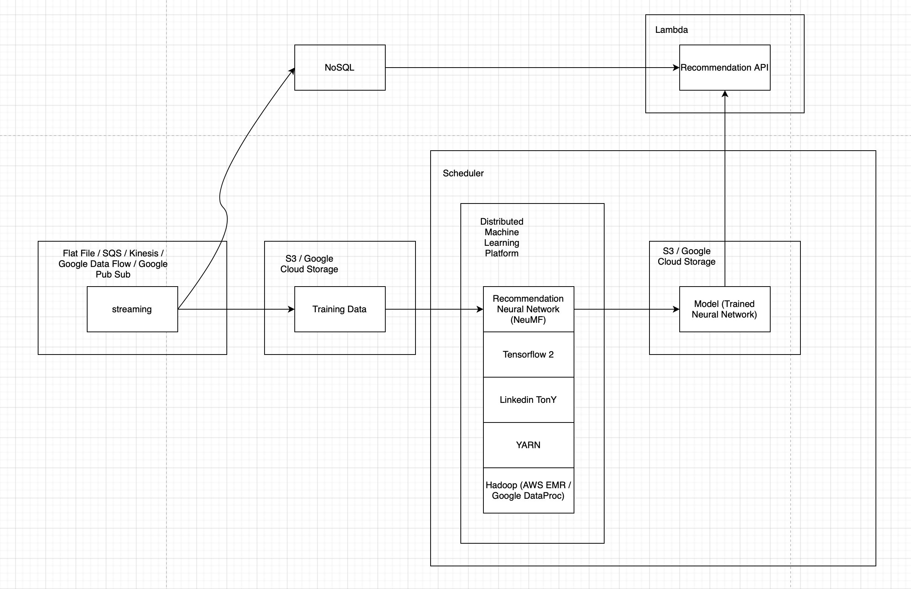

# financial-product-recommendation-system
This is a sample project for Financial Product Recommendation System


## Installation
Use the package manager [pip](https://pip.pypa.io/en/stable/) to install python dependencies.

```bash
pip3 install -r requirements.txt
```

## Dataset
If you want to get hold of the latest data set please visit [WealthML](https://github.com/twinzom/WealthML)

## Application Configuration
Before you begin, please update the configuration (./src/main/resources/application.yml)
```yaml
nn:
  file:
    #This is the File for processing
    input: /Users/xxx/Desktop/workspace/financial-product-recommendation-system/src/main/resources/CUST_INVESTMENT.csv
    #This is the post process file
    output: /Users/xxx/Desktop/workspace/financial-product-recommendation-system/output/data_reference.csv
  #This is the check point object of the neural network (weight only)
  checkpoint: /Users/xxx/Desktop/workspace/financial-product-recommendation-system/output/
  #This is the complete model of the neural network
  model: /Users/xxx/Desktop/workspace/financial-product-recommendation-system/output/recommendation_system_model.h5
```
## Data Visualisation Configuration
Before you begin, please update the data visualisaton configuration (./visualisation.html) <br/>
If you are using default endpoint then you do not need to update this config
```
line 47: url = "http://localhost:5000/recommendation/data"
```

## Usage
### 1) Train the neural network
```bash
python3 ./src/main/python/rs_nn.py
```
### 2) Startup API Server to serve API Request
```bash
python3 ./src/main/python/rs_api.py
```

### User Recommendation API
#### End Point (Default)
```
http://127.0.0.1:5000/recommendation/user
```
#### Request Parameter
```
{
	"product_name": "U62300",
	"3year_return": "11.37",
	"standard_deviation": "20.12",
	"dividend": "0.22",
	"asset_class": "Equity Developed Market"
}
```


### Product Recommendation API
#### End Point (Default)
```
http://127.0.0.1:5000/recommendation/product
```
#### Request Parameter
```
{
	"user": "CUST00000134",
	"age": 20,
	"gender": "M",
	"maritalStatus": "SINGLE",
	"haveChild": "N",
	"education": "SECONDARY"
}
```


### Recommendation Data API
#### End Point (Default)
```
http://localhost:5000/recommendation/data
```
#### Request Parameter
```
http://localhost:5000/recommendation/data?user=CUST00000134
http://localhost:5000/recommendation/data?age=20
http://localhost:5000/recommendation/data?gender=M
http://localhost:5000/recommendation/data?marital_status=SINGLE
http://localhost:5000/recommendation/data?have_child=N
http://localhost:5000/recommendation/data?education=SECONDARY
http://localhost:5000/recommendation/data?product_name=U62300
http://localhost:5000/recommendation/data?3year_return=11.37
http://localhost:5000/recommendation/data?standard_deviation=20.12
http://localhost:5000/recommendation/data?dividend=0.22
http://localhost:5000/recommendation/data?asset_class=Equity Developed Market
http://localhost:5000/recommendation/data?age_category=18-38
http://localhost:5000/recommendation/data?user_index=131
http://localhost:5000/recommendation/data?age_index=1
http://localhost:5000/recommendation/data?gender_index=1
http://localhost:5000/recommendation/data?education_index=2
http://localhost:5000/recommendation/data?have_child_index=0
http://localhost:5000/recommendation/data?marital_status_index=2
http://localhost:5000/recommendation/data?product_index=3
http://localhost:5000/recommendation/data?asset_class_index=0
```


### Data Visualisation Tool


### Production Architecture Diagram

